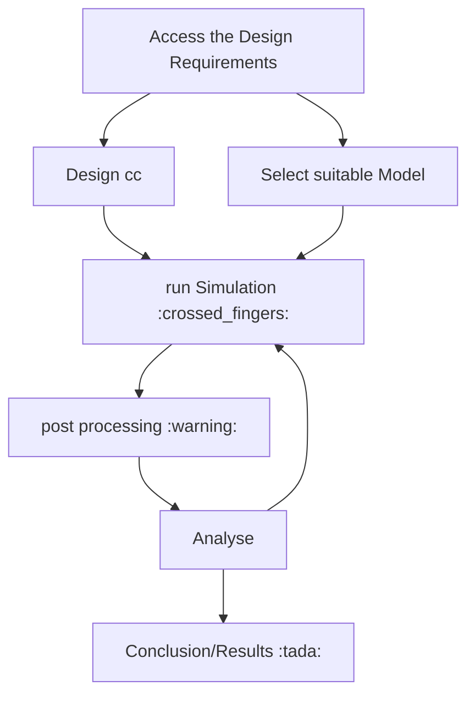

# cryo-manuscripts

- [x] Access the Design Requirements
- [ ] Design cc
- [ ] Select suitable Model
- [ ] Impliment model
- [ ] run Simulation
- [ ] post processing
- [ ] Analyse
- [ ] Conclusion/Results
