# cryo-manuscripts
### Process

```mermaid
 flowchart TD;
 A[Access the Design Requirements✅]-->B[Design cc];
 A-->C[Select suitable Model];
 B-->D[Impliment model];
 C-->D[run Simulation 🤞];
 D-->E[post processing ⚠️];
 E-->F[Analyse 📝];
 F--💥-->D
 F-->G[Conclusion/Results 🎉];
  
```

### EVENTS
- [x] Access the Design Requirements                       <progress value="100" max="100">100%</progress>
- [ ] Design cc                                            <progress value="20" max="100">20%</progress>
- [ ] Select suitable Model                                <progress value="60" max="100">60%</progress>
- [ ] Impliment model                                      <progress value="0" max="100">0%</progress>
- [ ] run Simulation                                       <progress value="0" max="100">0%</progress>
- [ ] post processing                                      <progress value="0" max="100">0%</progress>
- [ ] Analyse                                              <progress value="0" max="100">0%</progress>
- [ ] Conclusion/Results                                   <progress value="0" max="100">0%</progress>

>[!WARNING]
> SCARY SHIT IS HIGHLY UNSTABLE!!!

>[!IMPORTANT]
> FINISH WITH DESIGN, BEFORE SELECTING MODEL
