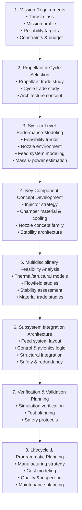
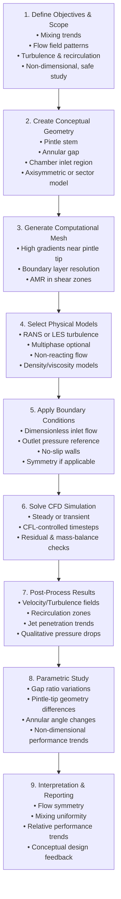

```mermaid
flowchart TD

A[1. Mission Requirements<br>• Thrust class<br>• Mission profile<br>• Reliability targets<br>• Constraints & budget]

B[2. Propellant & Cycle Selection<br>• Propellant trade study<br>• Cycle trade study<br>• Architecture concept]

C[3. System-Level Performance Modeling<br>• Feasibility trends<br>• Nozzle environment<br>• Feed system modeling<br>• Mass & power estimation]

D[4. Key Component Concept Development<br>• Injector strategy<br>• Chamber material & cooling<br>• Nozzle concept family<br>• Stability architecture]

E[5. Multidisciplinary Feasibility Analysis<br>• Thermal/structural models<br>• Flowfield studies<br>• Stability assessment<br>• Material trade studies]

F[6. Subsystem Integration Architecture<br>• Feed system layout<br>• Control & avionics logic<br>• Structural integration<br>• Safety & redundancy]

G[7. Verification & Validation Planning<br>• Simulation verification<br>• Test planning<br>• Safety protocols]

H[8. Lifecycle & Programmatic Planning<br>• Manufacturing strategy<br>• Cost modeling<br>• Quality & inspection<br>• Maintenance planning]

A --> B --> C --> D --> E --> F --> G --> H
```

```mermaid
flowchart TD

A[1. Define Objectives & Scope<br>• Mixing trends<br>• Flow field patterns<br>• Turbulence & recirculation<br>• Non-dimensional, safe study] --> B

B[2. Create Conceptual Geometry<br>• Pintle stem<br>• Annular gap<br>• Chamber inlet region<br>• Axisymmetric or sector model] --> C

C[3. Generate Computational Mesh<br>• High gradients near pintle tip<br>• Boundary layer resolution<br>• AMR in shear zones] --> D

D[4. Select Physical Models<br>• RANS or LES turbulence<br>• Multiphase optional<br>• Non-reacting flow<br>• Density/viscosity models] --> E

E[5. Apply Boundary Conditions<br>• Dimensionless inlet flow<br>• Outlet pressure reference<br>• No-slip walls<br>• Symmetry if applicable] --> F

F[6. Solve CFD Simulation<br>• Steady or transient<br>• CFL-controlled timesteps<br>• Residual & mass-balance checks] --> G

G[7. Post-Process Results<br>• Velocity/Turbulence fields<br>• Recirculation zones<br>• Jet penetration trends<br>• Qualitative pressure drops] --> H

H[8. Parametric Study<br>• Gap ratio variations<br>• Pintle-tip geometry differences<br>• Annular angle changes<br>• Non-dimensional performance trends] --> I

I[9. Interpretation & Reporting<br>• Flow symmetry<br>• Mixing uniformity<br>• Relative performance trends<br>• Conceptual design feedback]

```
